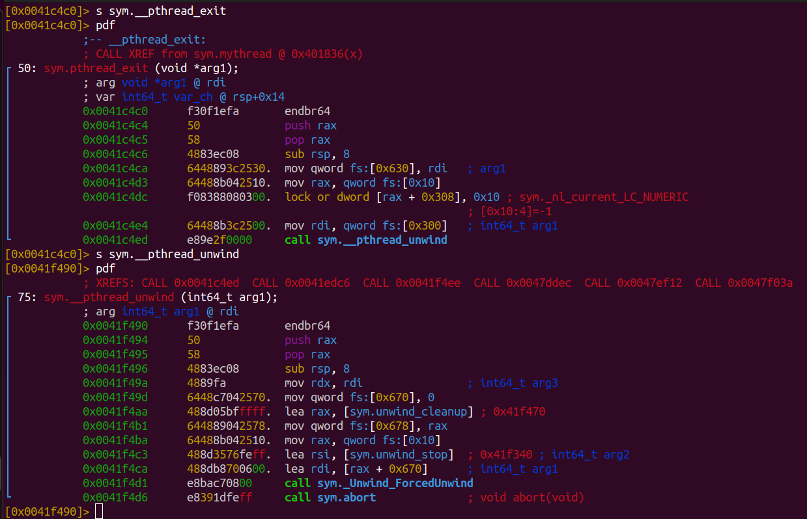
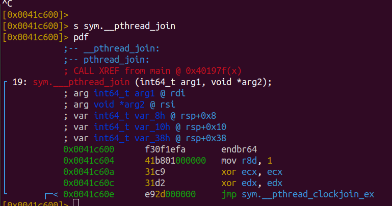
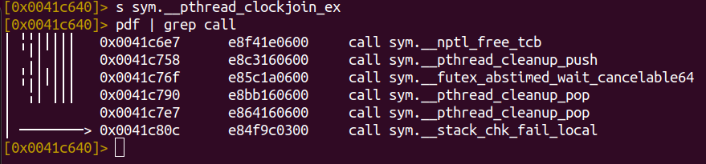

### rt_sigaction
системный вызов rt_sigaction для установки обработчика сигнала SIGRT_1. Он задает обработчик сигнала и некоторые флаги для его обработки.

### rt_sigprocmask
системный вызов rt_sigprocmask для снятия блокировки сигналов RTMIN и RT_1.

### nmap
Системный вызов mmap для создания отображения памяти c защитой PROT_NONE для выделения стека.

### mprotect
Системный вызов mprotect для изменения атрибутов памяти, разрешая чтение и запись для указанного диапазона адресов. 

### clone3
clone3({flags=CLONE_VM|CLONE_FS|CLONE_FILES|CLONE_SIGHAND|CLONE_THREAD|CLONE_SYSVSEM|CLONE_SETTLS|CLONE_PARENT_SETTID|CLONE_CHILD_CLEARTID, child_tid=0x7f95a69ff910, parent_tid=0x7f95a69ff910, exit_signal=0, stack=0x7f95a61ff000, stack_size=0x7fff00, tls=0x7f95a69ff640} => {parent_tid=[0]}, 88) = 100380
Системный вызов clone3 для создания нового потока (thread) в процессе с заданными параметрами. Результат - создан новый поток.

### Вопросы
- [x] **1.1.1. Рассказать процесс создания потока**
На уровне POSIX API вызывается:
```C
pthread_create
```
Создается сущность PD (pthread descriptor ?[Автор не уверен в себе, выезжает за счёт рекурсий]) и определяется владелец этой сущности (для случаев joinable/detached)
На уровне ОС выделяется структура task, регистрируется в планировщике.
Системными вызовами clone, mmap, mprotect создается новое адресное пространство.

- [x] **1.1.2. Чем поток отличается от процесса**
С точки знерия диспетчеризации - нет явной разницы.
С точки зрения разделения памяти - потоки делят адресное пространства процесса, процессы не имеют прямого доступа к данным в памяти друг друга.
- [ ] **1.1.3. как завершается процесс с несколькими потоками, что с ними происходит по завершении**


- [x] **1.2.2 где хранится  значение, возвращаемое из функции потока**


Пользовательский код может определять память для хранения возвращаемых значений. Рекомендуется выбирать НЕ стек завершаемого потока, так как  поведение памяти на стеке после thread_exit не определено. 
- [ ] **1.2.3 чем отличается joinable и детачед поток. чем отличается их завершение**

- [ ] **1.3.1 как производится передача аргументов в поток**

- [x] **Как передается вдрес поточной функции**
    До вызова сискола (на уровне оберток) указатель передается через параметры. На уровне сискола создается метка для перехода в ассемблерный код:
    ```asm
    	call	*%edx		/* Call function.  */
    ```
- [ ] **1.4.1 как работает отмена потоков через pthread-cancel(что происходит от момента когда вы в одном потоке написали cancel и до реальной остановки потока)**
псевдокод функции 
В оригинале обеспечивается атомарность,
ряд проверок зациклен.
```c++
int
__pthread_cancel(pthread_t th) {
    if (!is_thread_exist(th)) {
        return NO_SUCH_THREAD;
    }

    #ifdef SHARED
        pthread_cancel_init();
    #endif

    pthread* pth = get_pthread(th);
    int oldval = pth->cancelhandling;

    int newval = setbit(oldval, CANCELING_BITMASK, CANCELED_BITMASK);

    if (is_async_canceling()) {
        int err = throw_signal(SIGCANCEL);
        returnErrorOrIgnore(err);
    } else {
        abort();
    }

    if(is_suicide()) {
        return set_cancelation_point();
    }

    return 0;
}
```

- [ ] **1.4.2 в каких местах можно прерывать исполнение потока**

- [ ] **1.4.3. что будет если во время обработки кэнселейшена еще однин раз будет вызвана отмена.**

- [ ] **1.4.4(бонус) что будет если сказать cancel на самого себя**

- [ ] **1.5.1. чем  отличается обработка сигнала через обычный обработчик и sigwait**

- [x] **gettid - Что за идентификатор потока возвращается**
уникальный (единовременно уникальный, но не гарантируется полная уникальность в рамках сеанса работы ОС) идентификатор ядерного потока.

- [x] **Где располагается стэк потока, в какой момент стек освобождается, что за место между стэками потоков**
Располагается за кучей. Оснащен жирной канарейкой.
Освобождается при джоине потока.
- [] **Clone что именно делает и с какими параметрами мы его запускаем при создании потока**

- [ ] **Что остается от потока пока не вызван join, что будет если не вызвать join в поток**

- [x] **1.2.1 что происходит при join-e потока**

- [x] **Что происходит при завершении потока и как работаент join**





Освобождение ресурсов в join-е
```c++

void
__nptl_free_tcb (struct pthread *pd)
{
  /* The thread is exiting now.  */
  if (atomic_bit_test_set (&pd->cancelhandling, TERMINATED_BIT) == 0)
    {
      /* Free TPP data.  */
      if (pd->tpp != NULL)
        {
          struct priority_protection_data *tpp = pd->tpp;
          pd->tpp = NULL;
          free (tpp);
        }
      /* Queue the stack memory block for reuse and exit the process.  The
         kernel will signal via writing to the address returned by
         QUEUE-STACK when the stack is available.  */
      __nptl_deallocate_stack (pd);
    }
}
libc_hidden_def (__nptl_free_tcb)
```
- [x] **fork and clone diff**
    Clone предоставляет больше возможностей для настройки разделяемых ресурсов и потока выполнения.
- [x] **Кто меняет контекст?**
На уровне ядра операционной системы модуль планировщика 
(происходит сохранение контекста, выбор новой задачи, обновление контекста, мониторинг времени выполнения).

- [ ] **Что такое TLS. Что делают остальные флажки clone** 
     **CLONE_VM, CLONE_FS, CLONE_FILES**
      These flags select semantics with shared address space and
      file descriptors according to what POSIX requires.
    **CLONE_SIGHAND, CLONE_THREAD**
	This flag selects the POSIX signal semantics and various
	other kinds of sharing (itimers, POSIX timers, etc.).
    **CLONE_SETTLS**
	The sixth parameter to CLONE determines the TLS area for the
	new thread.
    **CLONE_PARENT_SETTID**
	The kernels writes the thread ID of the newly created thread
	into the location pointed to by the fifth parameters to CLONE.
	Note that it would be semantically equivalent to use
	**CLONE_CHILD_SETTID but it is be more expensive in the kernel.**
     CLONE_CHILD_CLEARTID
	The kernels clears the thread ID of a thread that has called
	sys_exit() in the location pointed to by the seventh parameter
	to CLONE.

/* Мы в значительной степени полагаемся на различные флаги, которые понимает функция CLONE:
     CLONE_VM, CLONE_FS, CLONE_FILES
	Эти флаги выбирают семантику с общим адресным пространством и
	файловые дескрипторы в соответствии с требованиями POSIX.
     CLONE_SIGHAND, CLONE_THREAD
	Этот флаг выбирает семантику сигнала POSIX и различные
	другие виды совместного использования (таймеры, таймеры POSIX и т. д.).
     CLONE_SETTLS
	Шестой параметр CLONE определяет область TLS для
	новый поток.
     CLONE_PARENT_SETTID
	Ядра записывают идентификатор вновь созданного потока.
	в место, указанное пятым параметром CLONE.
	Обратите внимание, что это было бы семантически эквивалентно использованию
	CLONE_CHILD_SETTID, но в ядре он стоит дороже.
     CLONE_CHILD_CLEARTID
	Ядра очищают идентификатор потока, который вызвал
	sys_exit() в месте, указанном седьмым параметром.
	клонировать.
     Сигнал завершения выбирается равным нулю, что означает отсутствие сигнала.
     отправлено. */
- [ ] **Какие системные вызовы являются точами отмены** 

- [ ] **какие функции можно прервать pthread_cancel-ом** 

- [ ] **что будет, если вместо джоина потока сделать pthread_exit** 

- [ ] **cleanup_handler в cleanup_handler-е, pthreda_cacnecl  пока второй поток внутри cleanup handler-а** 

- [ ] **Что именно происходит при падении pthread_create. Каких ресурсов не хватает**
```c
// Кусок кода функции pthread_create
// До этого явных возвратов из функции не производилось.
  int ret = __clone_internal (&args, &start_thread, pd);
  if (__glibc_unlikely (ret == -1))
    return errno;
  /* It's started now, so if we fail below, we'll have to let it clean itself
     up.  */
  *thread_ran = true;
  /* Now we have the possibility to set scheduling parameters etc.  */
  if (attr != NULL)
    {
      /* Set the affinity mask if necessary.  */
      if (need_setaffinity)
	{
	  assert (*stopped_start);
	  int res = INTERNAL_SYSCALL_CALL (sched_setaffinity, pd->tid,
					   attr->extension->cpusetsize,
					   attr->extension->cpuset);
	  if (__glibc_unlikely (INTERNAL_SYSCALL_ERROR_P (res)))
	    return INTERNAL_SYSCALL_ERRNO (res);
	}
      /* Set the scheduling parameters.  */
      if ((attr->flags & ATTR_FLAG_NOTINHERITSCHED) != 0)
	{
	  assert (*stopped_start);
	  int res = INTERNAL_SYSCALL_CALL (sched_setscheduler, pd->tid,
					   pd->schedpolicy, &pd->schedparam);
	  if (__glibc_unlikely (INTERNAL_SYSCALL_ERROR_P (res)))
	    return INTERNAL_SYSCALL_ERRNO (res);
	}
    }
  return 0;
}

```
