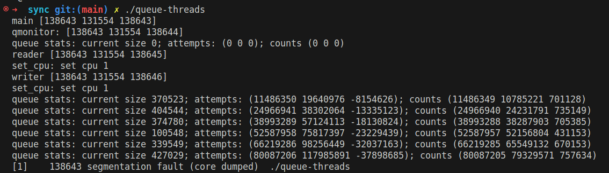
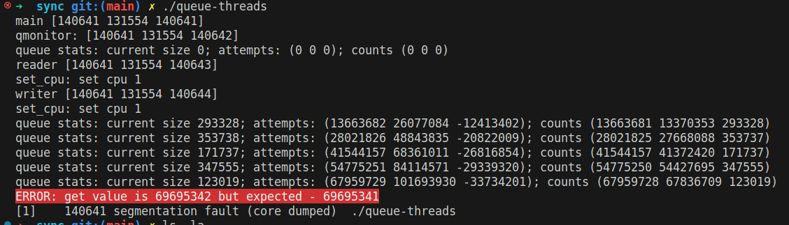
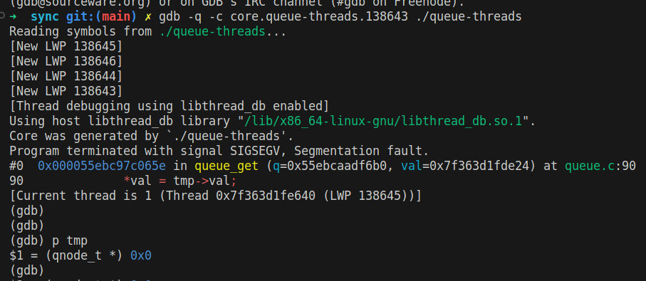
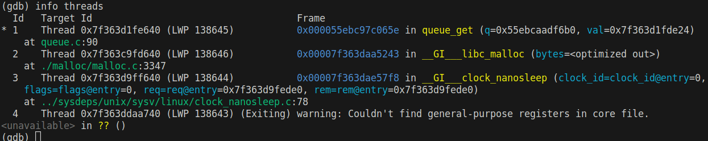
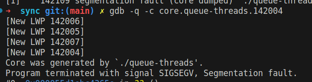
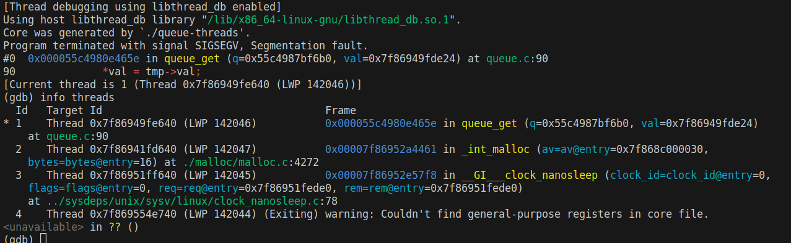
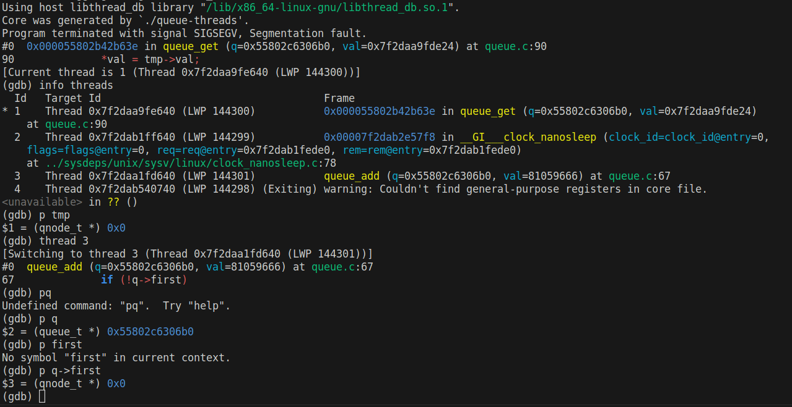
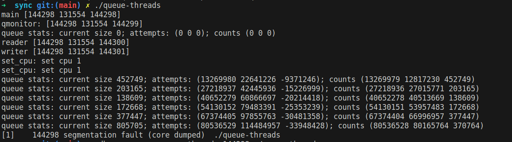

Что поймали:

___________________________________

Что было в корках:

_____________________________

ВЫВОД: поломалась куча (?)

______________________________________

Раскидали на два разных ядра:

после увеличения размера очереди и выключения sched_yeld:

__________________________

